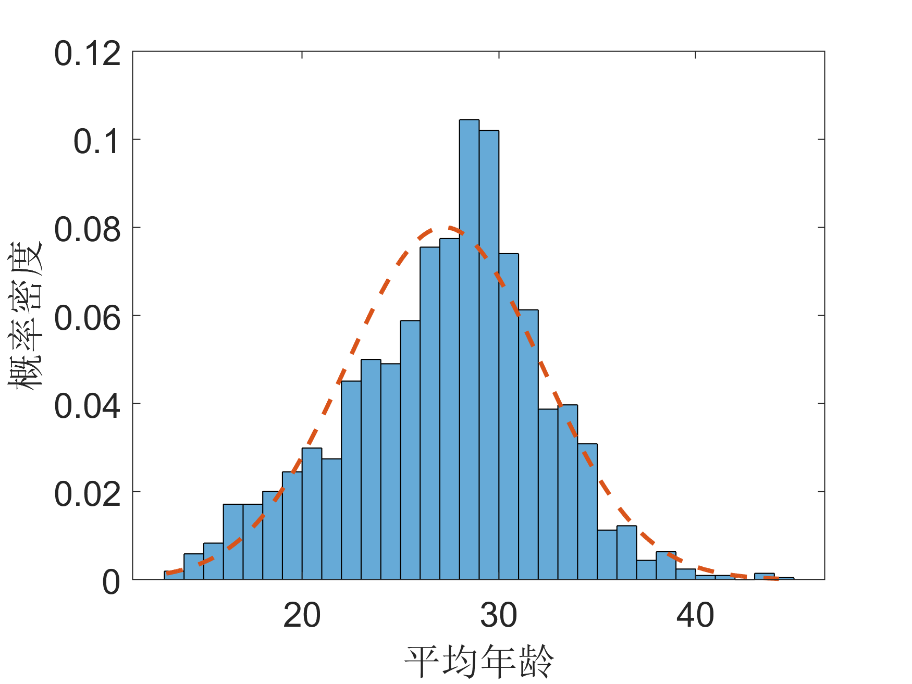
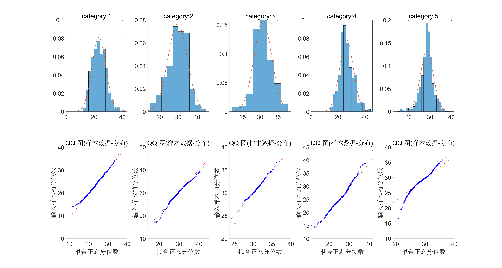
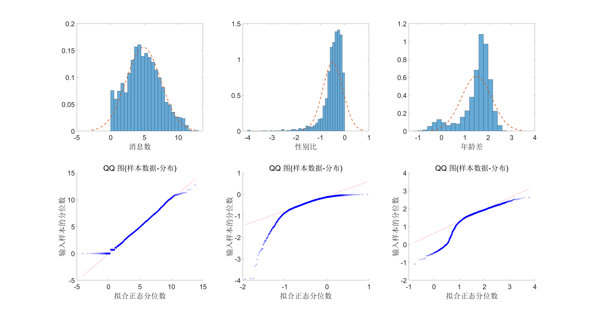
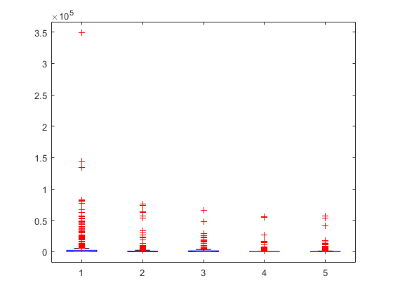

1.回忆并写出单因素方差分析的假设：

* 数据是随机采样获得的
* 不同组的数据的方差大致相等：
  * 不同组满足同方差性质
  * 或满足经验法则：最大组内方差小于最小组内方差的2倍
* 残差是正态分布的（不是偏斜的）

2.衡量平均年龄在不同类型的组别间是否有显著差异，写出零假设和备择假设：

零假设(H0)：所有组别中用户的平均年龄的平均值相等

备择假设(H1)：不是所有组别的用户平均年龄的平均值都相等

3.分析数据

(a)检验平均年龄这一数据是否符合正态分布，画出概率密度函数分布

{#fig:pdf_arg_age width=10cm}

从[@fig:pdf_arg_age]可以看出，平均年龄的分布与拟合出的正态分布相比，峰值略向右侧偏移。为了更清楚地比较该分布与正态分布的相似程度，我们采用分位数图示法(即画出QQ图)进行比较。

{#fig:qq_arg_age width=10cm}

Q-Q图用图形的方式比较两个概率分布，横纵坐标分别表示分布的分位数，如果两个分布相似，则该Q-Q图趋近于落在y=x线上。从[@fig:qq_arg_age]中可以看出，数据分布与拟合的结果存在着一些偏差。

为了从定量的角度分析该分布分布是否服从正态分布，采用了柯尔莫可洛夫-斯米洛夫检验方法(K-S)。该方法计算经验分布与标准分布的最大距离作为检验统计量以进行假设检验。在显著性水平为0.05时，结果为
$$
  P-value = 7.962e-6 < 0.05
$$
表明需要拒绝零假设，即该分布不服从正态分布。

(b)分布检验5个组别中平均年龄这一数据是否符合正态分布，并检验同方差性质

{#fig:sub_arg_age}

[@fig:sub_arg_age]显示了各类别中平均年龄的分布情况，其中类别1 ~ 3从QQ图上看更近似一条直线，4、5两类有些弯曲。此外，同样做了K-S检验，结果如下：

||类别1|类别2|类别3|类别4|类别5|
|:-:|:-:|:-:|:-:|:-:|:-:|
|P-value|0.2704|0.5764|0.7103|0.019|4.044e-4
|variance|4.9238|5.2174|2.5529|5.0983|3.019|

Table: 平均年龄K-S检验结果与方差

根据上表可以判定类别1 ~ 3中的平均年龄服从正态分布，类别4、5中的不服从。此外，根据上表中组内方差的计算结果，最大方差为5.2174，最小方差为2.5529，$2.5529*2=5.1058 < 5.2174$即不满足同方差的性质。

(c)做方差分析，给出结论、统计结果以及可视化

|Source|SS|df|MS|F|P-value(F)|
|:-:|:-:|:-:|:-:|:-:|:-:|
|Between|12782.9|4|3195.73|171.51|1.082e-126
|Within|37918.6|2035|18.63|||
|Total|50701.5|2039||||

Table: 平均年龄方差分析

表X展示了方差分析的结果，从中看出F统计量的值很大，p值很小，说明需要拒绝零假设，接受备择假设。结论：不是所有组别的用户平均年龄的平均值都相等。

{#fig:boxplot_total}

箱形图中的红线代表数据的中位数，矩形盒两端边的位置分别对应数据的上下四分位数，最外侧的两条线代表上下边缘，边缘之外的点认为是异常值。可见不同类别群组中平均年龄的分布差异较大。

4.选择3列数据并画出概率密度函数分布，检验是否满足问题1中的假设条件。以及考虑对数形式

分别选择了消息数、性别比以及年龄差作为分析的数据。

{#fig:factor_analysis}

||消息数|性别比|年龄差|
|:-:|:-:|:-:|:-:|
|P-value|7.04e-120|0.0023|0.0022|
|最大组内方差|153.0545|0.2438|2.5902|
|最小组内方差|53.0848|0.1185|1.6302|

Table: 其他特征K-S检验结果与方差

从上表可以看出，消息数、性别比以及年龄差这三列数据在显著性水平为0.05时均不满足正态分布。消息数、性别比不满足同方差性质；年龄差满足这一性质。

对以上三列数据取对数，重复上述分析：

{#fig:factor_analysis_log}

||消息数|性别比|年龄差|
|:-:|:-:|:-:|:-:|
|P-value|1.377e-27|5.340e-34|1.7961e-48|
|最大组内方差|0.7248|0.5428|0.8447|
|最小组内方差|0.3960|0.2460|0.2819|

Table: 对数形式特征K-S检验结果与方差

从上表可以看出，消息数、性别比以及年龄差这三列数据的对数形式均不满足正态分布。性别比、年龄差的对数不满足同方差性质；消息数的对数满足这一性质。

5.对非标准的数据做单因素方差分析

(a)列出可行的方式

* 认为方差分析是鲁棒的，对非高斯分布应用方差分析，对于第一类错误概率的影响很小，可以容忍。
* 使用非参数化的Kruskal-Wallis H检测
* 对于不满足同方差性质的数据，可采用Brown and Forsythe test或Welch检测

(b)对三列做方差分析，并可视化结果

|Source|SS|df|MS|F|P-value(F)|
|:-:|:-:|:-:|:-:|:-:|:-:|
|Between|2.06993e6|4|517481.7|30.7|7.53686e-25
|Within|3.43009e7|2035|16855.5|||
|Total|3.63708e7|2039||||

Table: 消息数方差分析

|Source|SS|df|MS|F|P-value(F)|
|:-:|:-:|:-:|:-:|:-:|:-:|
|Between|7.1647|4|1.79117|54.02|2.53208e-43
|Within|67.48|2035|0.03316|||
|Total|74.6447|2039||||

Table: 性别比方差分析

|Source|SS|df|MS|F|P-value(F)|
|:-:|:-:|:-:|:-:|:-:|:-:|
|Between|3338.2|4|834.559|200.24|6.317e-145
|Within|8481.4|2035|4.168|||
|Total|11819.6|2039||||

Table: 年龄差方差分析

可以看出消息数、性别比以及年龄差的平均值在不同组别中有显著差异

{#fig:boxplot_age_dif}

6.选择两个组别做逻辑回归，列出实验设置和结果

* 选取类别1与类别2进行逻辑回归
* 输入为12个归一化特征
* 采用sklearn中的LogisticRegression模型
* 未引入正则化项
* 采用随机梯度下降的方式计算参数，最大迭代次数300

{#fig:logistic}

[@fig:logistic]中黄色的点代表原始输入数据的类别，蓝色的点为逻辑回归拟合的结果。输出值大于0.5认为是类别1，输出值小于0.5认为是类别0。经统计，逻辑回归的正确率为77.68%。

{#fig:logistic_multi}

[@fig:logistic_multi]中橙色的点为多分类输出结果，蓝色的点为输入数据对应的正确类别。经统计，多分类逻辑回归的正确率为61.67%。·

7.以10%的采样率做3(c)中的方差分析，重复10次计算F统计量的均值和方差。比较两种采样方式的差异，哪一种更稳健？与不采样时的差异以及原因

采用3种采样方式，每次重复进行100次

|F统计量\采样方式|简单随机抽样|系统随机抽样|分层随机抽样|
|:-:|:-:|:-:|:-:|
|均值|18.3800|18.3185|19.5997|
|方差|32.5748|33.2997|28.8514|

采用分层随机抽样更稳健，因为其按不用同的组别以一定比例进行抽取，更能反映数据全面整体的特征。

与不采样时相比F统计量近似小了10倍，这是由于组间方差的计算公式为

$$
  SS_b = \sum_{i=1}^{k}n_i(\mu_i - \bar\mu)^2
$$

其中$n_i$为每组中的样本数量，采样之后样本数变为原来的1/10，因此组间方差也近似减小10倍。